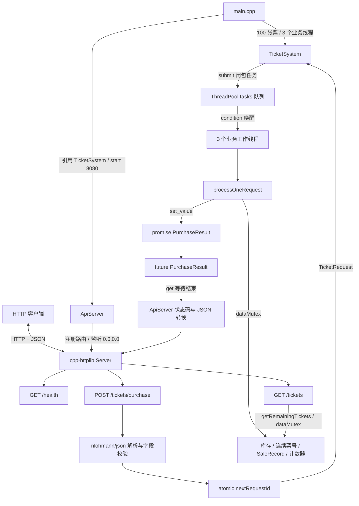
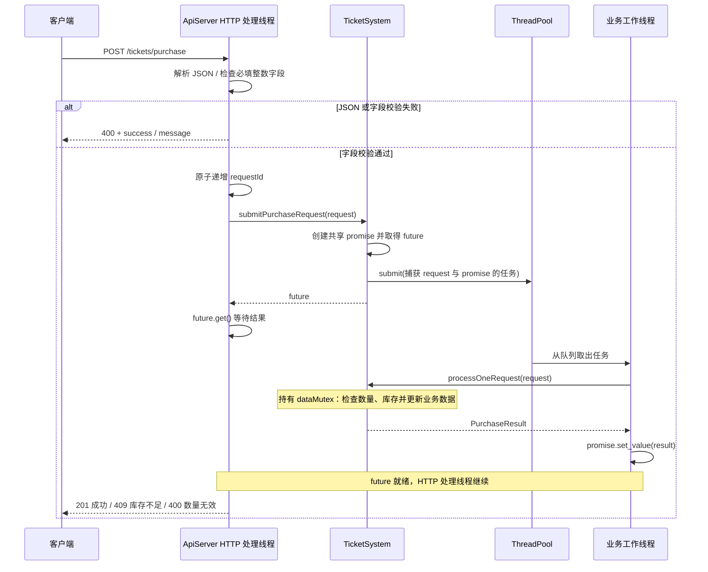

# V5 架构图与执行流程

[返回 README](../README.md) · [API 说明](API.md)

本文对应已提交的 V5 Network API 实现（源码提交 `31ad72b`，标签 `v5.0`）。

## 组件架构

| 组件 | 职责 | 对应源码 |
| --- | --- | --- |
| `main` | 创建业务系统和 API 服务，指定库存、线程数、端口 | [main.cpp](../TicketSystemCore/main.cpp) |
| `ApiServer` | 注册路由、解析 JSON、校验字段、分配请求编号、映射 HTTP 状态码 | [ApiServer.h](../TicketSystemCore/ApiServer.h)、[ApiServer.cpp](../TicketSystemCore/ApiServer.cpp) |
| `TicketSystem` | 检查购票数量与库存，分配票号，维护销售记录与请求统计 | [TicketSystem.h](../TicketSystemCore/TicketSystem.h)、[TicketSystem.cpp](../TicketSystemCore/TicketSystem.cpp) |
| `ThreadPool` | 保存通用任务、唤醒线程、跟踪活动任务、等待完成和回收线程 | [ThreadPool.h](../TicketSystemCore/ThreadPool.h)、[ThreadPool.cpp](../TicketSystemCore/ThreadPool.cpp) |

## 一次购票的时序

`GET /health` 直接返回固定 JSON；`GET /tickets` 加锁读取库存。这两个接口都不提交业务线程池任务。

## 并发与数据一致性

- **两层线程调度**：cpp-httplib 管理 HTTP 请求执行；自定义 `ThreadPool` 管理购票任务。`main` 中的 3 仅是业务工作线程数。
- **任务队列锁 `queueMutex`**：保护任务队列、`activeTasks` 和停止标志。工作线程取出任务后释放队列锁，再执行业务。
- **业务锁 `dataMutex`**：覆盖 `processOneRequest()` 的整个处理过程，保护库存、票号、销售记录和成功/失败计数。余票读取也使用此锁。
- **整单处理**：先检查数量大于 0，再检查库存足够；通过后一次性分配本单票号并扣减库存。数量无效或库存不足时不售出任何票。
- **请求编号**：`ApiServer::nextRequestId` 从 1 开始原子递增，字段校验通过后分配；不作为 HTTP 响应字段返回。
- **结果传递**：闭包按值捕获请求，用 `shared_ptr` 保持 `promise` 存活。调用方持有 `future`，通过 `get()` 获取 `PurchaseResult`。
- **顺序与快照**：任务按入队顺序出队，但多线程竞争业务锁，完成顺序不保证与请求编号一致。响应余票是该次业务处理时的快照。

## 生命周期与边界

服务器阻塞监听 `0.0.0.0:8080`。库存、票号、请求编号和销售记录只在当前进程内保存，重启后重新初始化。

正常调用线程池析构函数时，会先等待队列为空且 `activeTasks == 0`，再设置停止标志、唤醒并 `join` 工作线程。当前入口没有专门的 HTTP 优雅关闭流程，不能把强制终止进程视为完成了这一析构流程。

HTTP 层的异常捕获不覆盖业务工作线程中的异常；当前线程池未捕获任务异常，也未通过 `promise.set_exception()` 传递异常。`submitPurchaseRequest()` 未检查线程池 `submit()` 的布尔结果。上述属于当前实现边界。

V5 尚无数据库、登录鉴权、退款、HTTP 统计查询、请求幂等去重或业务队列容量限制。`printStatistics()` 和 `printSaleRecords()` 是 C++ 方法，未暴露为 HTTP 接口。
